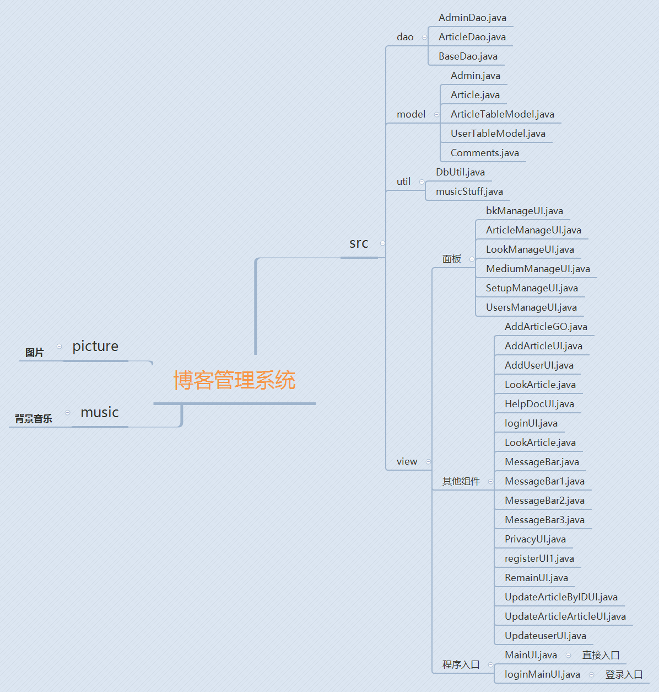

# 博客管理系统课设

#### 介绍
使用Java打造出界面精致，写作功能齐全的博客管理系统课程设计。

#### 软件架构
软件架构说明

#### 安装教程

1.  首先将SQL导入数据库
2.  然后将代码导入idea即可

#### 使用说明

1.  确定数据库导入完毕后，运行主程序loginMainUI 若有乱码情况，修改idea编码为utf-8
2.  说明：本博客管理系统是作为课设使用的，使用了大量的javaGUI来构造页面，相信会对初学Java要做课设的伙伴有帮助的。改博客管理系统实现的功能有：用户注册、用户登录、写文章、修改文章、删除文章、修改用户信息、添加用户、删除用户等主要功能。其中管理员具有用户管理功能，所有用户都可查看该博客系统的所有的文章，双击左键可查看文章，右键可删除文章，非管理员用户只能删除自己的文章。
3.  注：本博客管理系统由于当初课设时间较短，许多功能还不太完善，在后来将会进行相应完善，欢迎大家指正。

#### 参与贡献

1.  Fork 本仓库
2.  新建 Feat_xxx 分支
3.  提交代码
4.  新建 Pull Request

#### 特技

1.  Gitee 官方博客 [blog.gitee.com](https://blog.gitee.com)
